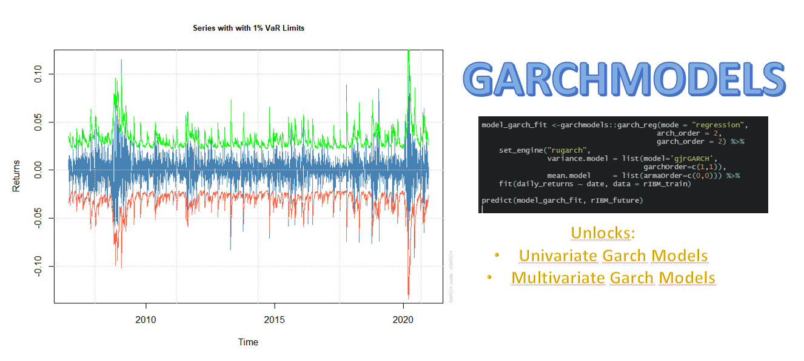

<!-- README.md is generated from README.Rmd. Please edit that file -->

```{r, include = FALSE}
knitr::opts_chunk$set(
  collapse = TRUE,
  comment = "#>",
  fig.path = "man/figures/README-",
  out.width = "100%",
  message = F,
  warning = F,
  dpi = 200
)
```

# garchmodels


<!-- badges: start -->
[](https://codecov.io/gh/AlbertoAlmuinha/garchmodels?branch=master)
[](https://www.tidyverse.org/lifecycle/#maturing)
[](https://github.com/Alberto-Almuinha/garchmodels/actions)
<!-- badges: end -->

> A parsnip backend for `GARCH` models in the `tidymodels` framework. 

## Tutorials

- [__Getting Started with Garchmodels__](https://albertoalmuinha.github.io/garchmodels/articles/getting-started.html): A walkthrough of the tidy modeling approach with the package.

## Installation

Not on CRAN yet:

``` r
#install.packages("garchmodels")
```

Development version:

``` r
# install.packages("devtools")
devtools::install_github("AlbertoAlmuinha/garchmodels")
```

## Why Garchmodels?

> Garchmodels unlocks univariate and multivariate GARCH models in one framework.

```{r, echo=F, out.width='100%', fig.align='center'}

```

In a single framework you will be able to find what you need:

- __Univariate Methods__: `garchmodels` connects to the `rugarch` package.

- __Multivariate Methods__: `garchmodels` connects to the `rugarch` and `rmgarch` packages. Available methods include DCC-Garch (Dynamic Conditional Correlation Garch), Copula Garch and GO-Garch models.

