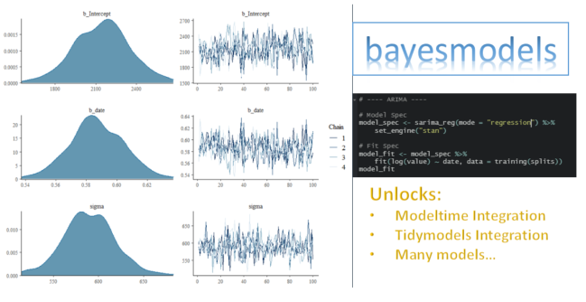

<!-- README.md is generated from README.Rmd. Please edit that file -->

```{r, include = FALSE}
knitr::opts_chunk$set(
  collapse = TRUE,
  comment = "#>",
  fig.path = "man/figures/README-",
  out.width = "100%",
  message = F,
  warning = F,
  dpi = 200
)
```

# bayesmodels


<!-- badges: start -->
[](https://CRAN.R-project.org/package=bayesmodels)
[](https://cran.r-project.org/package=bayesmodels)

[](https://codecov.io/gh/AlbertoAlmuinha/bayesmodels)
[](https://lifecycle.r-lib.org/articles/stages.html#maturing)
[](https://github.com/AlbertoAlmuinha/bayesmodels/actions)
<!-- badges: end -->

> A parsnip backend for `Bayesian` models in the `tidymodels` framework. 

## Tutorials

- [__Bayesmodels and Modeltime Integration__](https://albertoalmuinha.github.io/bayesmodels/articles/modeltime-integration.html): Learn how to integrate bayesian models with the modeltime ecosystem.

## Installation

CRAN version 

``` r
install.packages("bayesmodels")
```

Development version:

``` r
# install.packages("devtools")
devtools::install_github("AlbertoAlmuinha/bayesmodels")
```

## Why Bayesmodels?

> Bayesmodels unlocks multiple bayesian models in one framework.In addition, it allows you to integrate these models with the Modeltime and the Tidymodels ecosystems.

```{r, echo=F, out.width='100%', fig.align='center'}

```

In a single framework you will be able to find:

- __Sarima__: `bayesmodels` connects to the `bayesforecast` package.

- __Garch__: `bayesmodels` connects to the `bayesforecast` package.

- __Random Walk (Naive)__: `bayesmodels` connects to the `bayesforecast` package.

- __State Space Model__: `bayesmodels` connects to the `bayesforecast` and `bsts` packages.

- __Stochastic Volatility Model__: `bayesmodels` connects to the `bayesforecast` package.

- __Generalized Additive Models (GAMS)__: `bayesmodels` connects to the `brms` package.

- __Adaptive Splines Surface__: `bayesmodels` connects to the `BASS` package.

- __Exponential Smoothing__: `bayesmodels` connects to the `Rglt` package.

