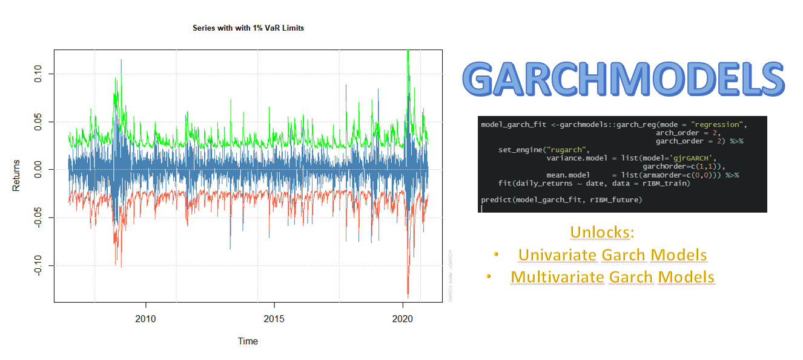
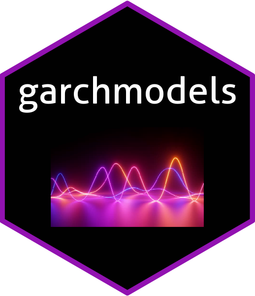

```{r, include = FALSE}
knitr::opts_chunk$set(
  collapse = TRUE,
  comment = "#>",
  
  out.width='100%',
  fig.align = "center",
  fig.width = 7,
  fig.height = 5,
  
  message = FALSE,
  warning = FALSE
)
```


```{r, echo=F,  out.width="100%", fig.align='center'}

```
<br>


This tutorial shows you how you can start using `garchmodels`. The first thing to be clear about is that the package has two main functions:

- __garch_reg__: This function implements the univariate models and currently its only engine is `rugarch`.

- __garch_multivariate_reg__: This function implements the multivariate methods and connects to the rugarch and rmgarch packages. The engines you can currently connect to are the following: `rugarch`, `dcc_rmgarch`, `c_rmgarch` and `gogarch_rmgarch`.

# Univariate Example

First, we load the necessary packages:

```{r setup}
library(garchmodels)
library(timetk)
library(tidymodels)
library(tidyverse)
```

The data we will use is IBM's daily returns from March 2007 through December 2020. The data is contained in a tibble that comes with the garchmodels package itself.

```{r}
rIBM
```

We will extend the dataset to a 3-day horizon forecast and separate the dataset into train and future dataset.

```{r}
rIBM_extended <- rIBM %>%
    future_frame(.length_out = 3, .bind_data = TRUE) 

rIBM_train  <- rIBM_extended %>% drop_na()
rIBM_future <- rIBM_extended %>% filter(is.na(daily_returns))
```

Next, we create the GARCH model for the variance:

```{r}
model_fit_garch <-garchmodels::garch_reg(mode = "regression",
                                         arch_order = 1,
                                         garch_order = 1,
                                         ma_order = 0,
                                         ar_order = 0) %>%
                  set_engine("rugarch", mean.model = list(include.mean = FALSE)) %>%
                  fit(daily_returns ~ date, data = rIBM_train)
```

We will graphically represent the Series with 1% VaR Limits and the Conditional SD (vs |returns|):

```{r}
plot(model_fit_garch$fit$models$model_1, which = 2)
```

```{r}
plot(model_fit_garch$fit$models$model_1, which = 3)
```

Let us now predict about the future dataset:

```{r}
predict(model_fit_garch, rIBM_future)
```


We will now create a combined model using a GARCH model for the variance and an ARMA model for the mean:

```{r}
model_fit_garch <-garchmodels::garch_reg(mode = "regression",
                                         arch_order = 1,
                                         garch_order = 1,
                                         ma_order = 2,
                                         ar_order = 2) %>%
                  set_engine("rugarch") %>%
                  fit(daily_returns ~ date, data = rIBM_train)

```

Let's again represent the Series with 1% VaR Limits and the Conditional SD (vs |returns|):

```{r}
plot(model_fit_garch$fit$models$model_1, which = 2)
```

```{r}
plot(model_fit_garch$fit$models$model_1, which = 3)
```

Let us now predict about the future dataset:

```{r}
predict(model_fit_garch, rIBM_future)
```

# Multivariate Example

For this section, we will work with the daily returns of IBM, Google and BP from 2007 to 2020. To work with multivariate models, the input format should be like this table:

```{r}
rX_longer
```

We will extend the dataset to a 3-day horizon forecast and separate the dataset into train and future dataset.

```{r}
rX_longer_extended <- rX_longer %>%
    group_by(id) %>%
    future_frame(.length_out = 3, .bind_data = TRUE) %>%
    ungroup()

rX_train  <- rX_longer_extended %>% drop_na()
rX_future <- rX_longer_extended %>% filter(is.na(value))
```


## Rugarch Engine

To create a model with the rugarch engine, the first thing to do is to specify in a list called "specs" through set_engine the specifications of the models. It is also important to note that the formula should always be the return against the date variable followed by the id variable. For more information see ?garch_multivariate_reg.

```{r}
model_fit <- garch_multivariate_reg(mode = "regression", type = "ugarchspec") %>%
    set_engine("rugarch" , specs = list(spec1 = list(mean.model = list(armaOrder = c(1,0))),
                                        spec2 = list(mean.model = list(armaOrder = c(1,0))),
                                        spec3 = list(mean.model = list(armaOrder = c(1,0)))),
    ) %>%
    fit(value ~ date + id, data = rX_train)
```

We now predict on the future dataset:

```{r}
predict(model_fit, rX_future)
```


## DCC Engine

To create a model with the `dcc_rmgarch` engine, the first thing to do is to specify in a list called __specs__ through set_engine the specifications of the models. You can also specify the arguments to be passed to `rmgarch::dccspec()` through the __dcc_specs__ list as seen in the following example:

```{r}
model_fit <- garch_multivariate_reg(type = "ugarchspec") %>%
    set_engine("dcc_rmgarch" , specs = list(spec1 = list(mean.model = list(armaOrder = c(1,0))),
                                            spec2 = list(mean.model = list(armaOrder = c(1,0))),
                                            spec3 = list(mean.model = list(armaOrder = c(1,0)))),
                               dcc_specs = list(dccOrder = c(2,2), distribution = "mvlaplace")) %>%
    fit(value ~ date + id, data = rX_train)
```


Let's visualize the graphics available through the model:

- Conditional Mean (vs Realized Returns):

```{r}
plot(model_fit$fit$models$model_1, which = 1)
```

- Conditional Sigma (vs Realized Absolute Returns)

```{r}
plot(model_fit$fit$models$model_1, which = 2)
```

- Conditional Covariance

```{r}
plot(model_fit$fit$models$model_1, which = 3)
```

- Conditional Correlation

```{r}
plot(model_fit$fit$models$model_1, which = 4)
```

- EW Portfolio Plot with conditional density VaR limitis

```{r}
plot(model_fit$fit$models$model_1, which = 5)
```


We now predict on the future dataset:

```{r}
predictions <- predict(model_fit, rX_future)
```

As you can see, the results are returned in a nested tibble. For example, if you want to get the correlation matrices:

```{r}
predictions %>% filter(.name == "R") %>% pull(.pred)
```


## Copula Engine

To create a model with the `c_rmgarch` engine, the first thing to do is to specify in a list called __specs__ through set_engine the specifications of the models. You can also specify the arguments to be passed to `rmgarch::cgarchspec()` through the __c_specs__ list as seen in the following example:

```{r}
model_fit <- garch_multivariate_reg(type = "ugarchspec") %>%
    set_engine("c_rmgarch" , specs = list(spec1 = list(mean.model = list(armaOrder = c(1,0))),
                                          spec2 = list(mean.model = list(armaOrder = c(1,0))),
                                          spec3 = list(mean.model = list(armaOrder = c(1,0)))),
                             c_specs = list(dccOrder = c(2,2))) %>%
    fit(value ~ date + id, data = rX_train)

model_fit
```


## Go-Garch Engine

To create a model with the `gogarch_rmgarch` engine, you can specify the arguments to be passed to `rmgarch::gogarchspec()` through the __gogarch_specs__ list. You can also specify other arguments that will be passed to `rmgarch::gogarchfit()`:

```{r, warning=FALSE, message=FALSE}
model_fit <- garch_multivariate_reg(type = "ugarchspec") %>%
         set_engine("gogarch_rmgarch" , gogarch_specs = list(variance.model = list(garchOrder = c(2,2)))) %>%
    fit(value ~ date + id, data = rX_train)
```
We now predict on the future dataset:

```{r}
predictions <- predict(model_fit, rX_future)
predictions
```

Let's look at the GARCH model coefficients:

```{r}
predictions %>% filter(.name == "garchcoef") %>% pull(.pred)
```

