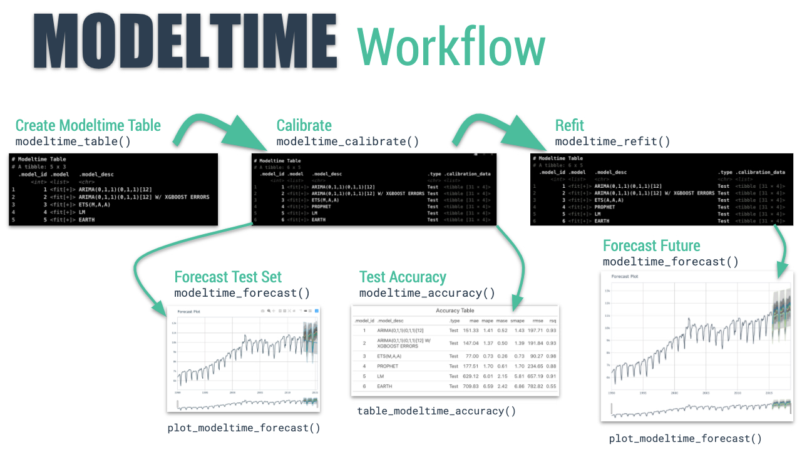

```{r, include = FALSE}
knitr::opts_chunk$set(
  collapse = TRUE,
  comment = "#>",
  
  out.width='100%',
  fig.align = "center",
  fig.width = 7,
  fig.height = 5,
  
  message = FALSE,
  warning = FALSE
)
```

```{r, echo=F,  out.width="100%", fig.align='center'}
knitr::include_graphics("modeltime_ecosystem.jpg")
```

<br>


In this tutorial you will learn how to use the __Bayesmodels__ package and how to integrate it with the usual __Modeltime__ workflow. The main purposes are:

- Use an Arima Bayesian model to see how it would apply in the __Bayesmodels__ package.

- Compare the above model with the classic implementation of the __Modeltime__ package through the usual workflow of the escosystem.

`Bayesmodels` unlocks the following models in one package. Precisely its greatest advantage is to be able to integrate these models with the `Modeltime` and `Tidymodels` ecosystems.

- __Arima__: `bayesmodels` connects to the `bayesforecast` package.

- __Garch__: `bayesmodels` connects to the `bayesforecast` package.

- __Random Walk (Naive)__: `bayesmodels` connects to the `bayesforecast` package.

- __State Space Model__: `bayesmodels` connects to the `bayesforecast` and `bsts` packages.

- __Stochastic Volatility Model__: `bayesmodels` connects to the `bayesforecast` package.

- __Generalized Additive Models (GAMS)__: `bayesmodels` connects to the `brms` package.

- __Adaptive Splines Surface__: `bayesmodels` connects to the `BASS` package.

- __Exponential Smoothing__: `bayesmodels` connects to the `Rglt` package.

## The Modeltime Workflow

Here's the general process and where the functions fit. 

```{r, echo=F,  out.width="100%", fig.align='center', fig.cap="The Modeltime Workflow"}

```

Just follow the `modeltime` workflow, which is detailed in 6 convenient steps:

1. Collect data and split into training and test sets
2. Create & Fit Multiple Models
3. Add fitted models to a __Model Table__
4. __Calibrate__ the models to a testing set.
5. Perform Testing Set _Forecast_ & _Accuracy_ Evaluation
6. __Refit__ the models to Full Dataset & _Forecast_ Forward

Let's go through a guided tour to kick the tires on `modeltime`. 

## Time Series Forecasting Example

Load libraries to complete this short tutorial.

```{r}
library(tidymodels)
library(bayesmodels)
library(modeltime)
library(tidyverse)
library(timetk)
library(lubridate)
# This toggles plots from plotly (interactive) to ggplot (static)
interactive <- FALSE
```
### Step 1 - Collect data and split into training and test sets. 

```{r}
# Data
m750 <- m4_monthly %>% filter(id == "M750")
```

We can visualize the dataset. 

```{r}
m750 %>%
  plot_time_series(date, value, .interactive = interactive)
```


Let's split the data into training and test sets using `initial_time_split()`

```{r}
# Split Data 80/20
splits <- initial_time_split(m750, prop = 0.9)
```


### Step 2 - Create & Fit Multiple Models

We can easily create dozens of forecasting models by combining `bayesmodels`, `modeltime` and `parsnip`. We can also use the `workflows` interface for adding preprocessing! Your forecasting possibilities are endless. Let's model a couple of arima models:


__Important note: Handling Date Features__

_Bayesmodels and Modeltime models_ (e.g. `sarima_reg() and arima_reg()`) are created with a date or date time feature in the model. You will see that most models include a formula like `fit(value ~ date, data)`. 

_Parsnip models_ (e.g. `linear_reg()`) typically should not have date features, but may contain derivatives of dates (e.g. month, year, etc). You will often see formulas like `fit(value ~ as.numeric(date) + month(date), data)`.

#### Model 1: ARIMA (Modeltime)

First, we create a basic univariate ARIMA model using "Arima" using `arima_reg()`

```{r, message=TRUE}
# Model 1: arima ----
model_fit_arima<- arima_reg(non_seasonal_ar = 0,
                            non_seasonal_differences = 1,
                            non_seasonal_ma = 1,
                            seasonal_period = 12,
                            seasonal_ar = 0,
                            seasonal_differences = 1,
                            seasonal_ma = 1) %>%
    set_engine(engine = "arima") %>%
    fit(value ~ date, data = training(splits))
```

#### Model 2: ARIMA (Bayesmodels)

Now, we create the same model but from a Bayesian perspective with the package `bayesmodels`:

```{r, message=TRUE}
# Model 2: arima_boost ----
model_fit_arima_bayes<- sarima_reg(non_seasonal_ar = 0,
                                  non_seasonal_differences = 1,
                                  non_seasonal_ma = 1,
                                  seasonal_period = 12,
                                  seasonal_ar = 0,
                                  seasonal_differences = 1,
                                  seasonal_ma = 1,
                                  pred_seed = 100) %>%
    set_engine(engine = "stan") %>%
    fit(value ~ date, data = training(splits))
```

```{r}
plot(model_fit_arima_bayes$fit$models$model_1)
```

#### Model 3: Random Walk (Naive) (Bayesmodels)

```{r}
model_fit_naive <- random_walk_reg(seasonal_random_walk = TRUE, seasonal_period = 12) %>%
                   set_engine("stan") %>%
                   fit(value ~ date + month(date), data = training(splits))
```

```{r}
plot(model_fit_naive$fit$models$model_1)
```


### Step 3 - Add fitted models to a Model Table. 

The next step is to add each of the models to a Modeltime Table using `modeltime_table()`. This step does some basic checking to make sure each of the models are fitted and that organizes into a scalable structure called a ___"Modeltime Table"___ that is used as part of our _forecasting workflow._

We have 2 models to add.

```{r, paged.print = FALSE}
models_tbl <- modeltime_table(
    model_fit_arima,
    model_fit_arima_bayes,
    model_fit_naive
)
models_tbl
```

### Step 4 - Calibrate the model to a testing set. 

Calibrating adds a new column, `.calibration_data`, with the test predictions and residuals inside. A few notes on Calibration:

- Calibration is how confidence intervals and accuracy metrics are determined 
- ___Calibration Data___ is simply forecasting predictions and residuals that are calculated from out-of-sample data.
- After calibrating, the calibration data follows the data through the forecasting workflow. 

```{r, paged.print = FALSE}
calibration_tbl <- models_tbl %>%
    modeltime_calibrate(new_data = testing(splits))
calibration_tbl
```

### Step 5 - Testing Set Forecast & Accuracy Evaluation

There are 2 critical parts to an evaluation.

- Visualizing the Forecast vs Test Data Set
- Evaluating the Test (Out of Sample) Accuracy

#### 5A - Visualizing the Forecast Test

Visualizing the Test Error is easy to do using the __interactive plotly visualization (just toggle the visibility of the models using the Legend).__ 

```{r}
calibration_tbl %>%
    modeltime_forecast(
        new_data    = testing(splits),
        actual_data = m750
    ) %>%
    plot_modeltime_forecast(
      .legend_max_width = 25, # For mobile screens
      .interactive      = interactive
    )
```

#### 5B - Accuracy Metrics

We can use `modeltime_accuracy()` to collect common accuracy metrics. The default reports the following metrics using `yardstick` functions:

- __MAE__ - Mean absolute error, `mae()`
- __MAPE__ - Mean absolute percentage error, `mape()`
- __MASE__ - Mean absolute scaled error, `mase()`
- __SMAPE__ - Symmetric mean absolute percentage error, `smape()`
- __RMSE__ - Root mean squared error, `rmse()`
- __RSQ__ - R-squared, `rsq()`

These of course can be customized following the rules for creating new yardstick metrics, but the defaults are very useful. Refer to `default_forecast_accuracy_metrics()` to learn more.

To make table-creation a bit easier, I've included `table_modeltime_accuracy()` for outputing results in either interactive (`reactable`) or static (`gt`) tables. 

```{r}
calibration_tbl %>%
    modeltime_accuracy() %>%
    table_modeltime_accuracy(
        .interactive = interactive
    )
```

### Step 6 - Refit to Full Dataset & Forecast Forward

The final step is to refit the models to the full dataset using `modeltime_refit()` and forecast them forward. 

```{r, paged.print = F, message=F}
refit_tbl <- calibration_tbl %>%
    modeltime_refit(data = m750)
refit_tbl %>%
    modeltime_forecast(h = "3 years", actual_data = m750) %>%
    plot_modeltime_forecast(
      .legend_max_width = 25, # For mobile screens
      .interactive      = interactive
    )
```
